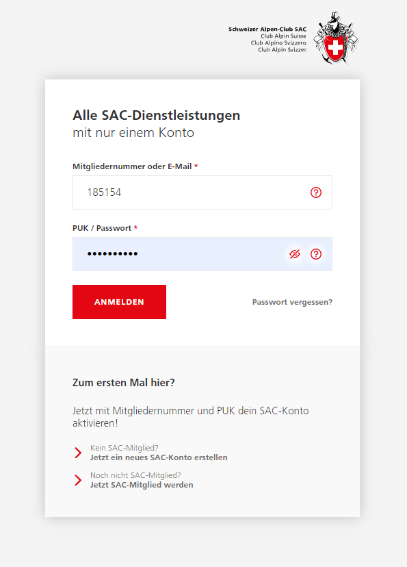

# SAC Login (OpenId Connect Login client für Contao)

Diese Erweiterung ermöglicht die Implementierung des Single Sign-On Logins des Schweizerischen Alpen Clubs (SAC) für Contao CMS.





DIe Erweiterung basiert auf markocupic/sac-event-tool_bundle und thephpleague/oauth2-client. 
Vor der Inbetriebnahme müssen mehrere Parameter in in der config/config.yml getätigt werden.

```
parameters:
  markocupic.swiss_alpine_club_contao_login_client_bundle.client_secret: '*************'
  markocupic.swiss_alpine_club_contao_login_client_bundle.redirect_uri: 'https://sac-pilatus.ch/ssoauth/frontend'
  markocupic.swiss_alpine_club_contao_login_client_bundle.url_authorize: 'https://ids01.sac-cas.ch:443/oauth2/authorize'
  markocupic.swiss_alpine_club_contao_login_client_bundle.url_access_token: 'https://ids01.sac-cas.ch:443/oauth2/token'
  markocupic.swiss_alpine_club_contao_login_client_bundle.resource_owner_details: 'https://ids01.sac-cas.ch:443/oauth2/userinfo'
  markocupic.swiss_alpine_club_contao_login_client_bundle.client_id: '***************'
  markocupic.swiss_alpine_club_contao_login_client_bundle.add_to_member_groups: 'a:1:{i:0;s:1:"9";}'
  markocupic.swiss_alpine_club_contao_login_client_bundle.redirect_uri_frontend: 'https://sac-pilatus.ch/ssoauth/frontend'
  markocupic.swiss_alpine_club_contao_login_client_bundle.redirect_uri_backend: 'https://sac-pilatus.ch/ssoauth/backend'
  markocupic.swiss_alpine_club_contao_login_client_bundle.enable_backend_sso: true
  markocupic.swiss_alpine_club_contao_login_client_bundle.url_logout: 'https://ids01.sac-cas.ch/oidc/logout'
```
