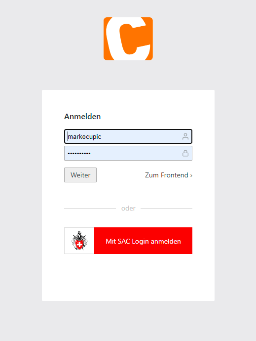

# SAC Login (OpenId Connect Login client für Contao)

Diese Erweiterung ermöglicht die Implementierung des Single Sign-On Logins des Schweizerischen Alpen Clubs (SAC) für Contao CMS.

DIe Erweiterung basiert auf markocupic/sac-event-tool_bundle und thephpleague/oauth2-client. 
Vor der Inbetriebnahme müssen mehrere Parameter in den Contao Backend Einstellungen getätigt werden.
